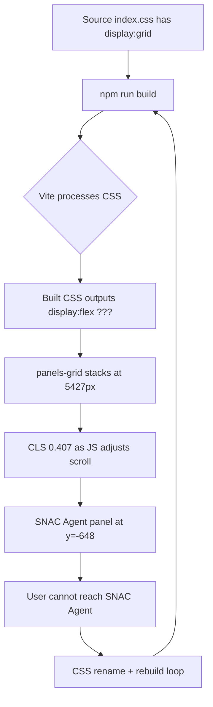
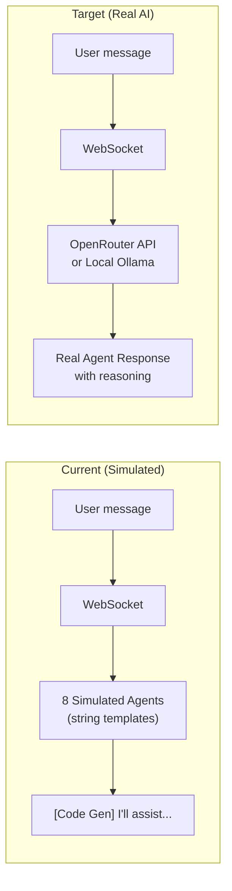

# Design Review Results: SNAC-v2 Cockpit (Full Audit)

**Review Date**: 2026-03-20  
**URL**: http://187.77.3.56 (live VPS)  
**Source**: `/opt/snac-v2/frontend/` (Nginx-served build)  
**Benchmark**: NVIDIA NemoClaw design language, Linear.app precision  
**Focus Areas**: All — Visual Design, UX/Usability, Accessibility, Layout, Performance  
**Special Priority**: Vision accessibility (50% loss), zero vertical scroll, high contrast

---

## Summary

The cockpit's intent is ambitious and well-structured — a live AI swarm mission control — but the deployed build has a **recurring layout regression** (`.panels-grid` reverts to `display: flex` after every rebuild), making the SNAC Agent panel entirely unreachable above the viewport. Combined with a CLS score of 0.407 (poor), harsh typography contrast, and the Free Coding Agent running fully simulated (zero LLM calls), the UI needs a structured CSS architecture fix and a visual elevation pass to match the sophistication of the system it controls.

---

## Issues

| # | Issue | Criticality | Category | Location |
|---|-------|-------------|----------|----------|
| 1 | **`.panels-grid` is `display: flex` not `display: grid`** in the deployed build. Computed height is 5427px. All panels stack vertically. SNAC Agent panel is rendered at y=−648, entirely above the visible viewport — it cannot be reached by scrolling or clicking. Build process is overwriting the CSS fix on every `npm run build`. | 🔴 Critical | Build/Layout | Live computed: `.panels-grid { display: flex }` — target: `display: grid; grid-template-columns: 1fr 1fr` |
| 2 | **SNAC Agent panel is unreachable**. The `panelsGrid` starts at y=−648 relative to the viewport. The parent `cockpitMain` has `overflow: hidden`, so the SNAC Agent is permanently clipped above the visible area. User has no way to reach or interact with it. | 🔴 Critical | UX/Usability | `.panels-grid` rect: `{ y: -648, h: 5427 }` — `.cockpit-main { overflow: hidden }` |
| 3 | **CLS (Cumulative Layout Shift) score: 0.407** — far above Google's "poor" threshold of 0.25. Elements are jumping significantly on load. This causes the panel grid to shift from a correct initial state to the broken flex-column state on render, which also causes the disorienting scroll-jump to y=−648. | 🔴 Critical | Performance | Browser Web Vitals report — likely cause: JS setting inline styles or class mutations after paint |
| 4 | **Free Coding Agent has zero LLM calls — fully simulated**. Docker logs confirm `✅ Ensemble initialized with 8 simulated agents`. Every response is a string template `[Code Generation] I'll assist with... `. No Ollama, no API, no reasoning. The "8-agent ensemble" is a facade. | 🔴 Critical | Functionality | `docker logs snac_free_coding_agent` |
| 5 | **SNAC Agent Ollama model still failing**. Backend now points to local `snac_ollama` container with `phi3:mini` but the model requires 3.5 GiB while only ~2.8 GiB free RAM. Free Coding Agent container consumes ~4 GiB, starving SNAC of RAM. Both cannot coexist on this VPS memory budget. | 🔴 Critical | Infrastructure | `OPENAI_MODEL=phi3:mini`, `OPENAI_BASE_URL=http://snac_ollama:11434/v1` |
| 6 | **No visual hierarchy between primary and secondary actions**. "Run Agent", "Ingest Document", "Ingest Thought", "Queue Swarm Task", "Add Learning" all use identical flat button styling. Primary submit actions are visually indistinguishable from secondary ones. For a vision-impaired user, this creates constant decision fatigue. | 🟠 High | Visual Design / Accessibility | `index.css` button styles — all identical flat `--accent-blue` background |
| 7 | **Sidebar has no section dividers**. "Agent Task", "Ingest Document", "Quick Thought", "Swarm Queue", "Add Learning", "Memory Injection", "Project Vault" sections are separated only by `gap: 30px` with no border or background contrast change. Sections merge visually at 50% vision. | 🟠 High | Accessibility | `.cockpit-sidebar`, `.sidebar-section` in `index.css` |
| 8 | **Panel headers have insufficient contrast for low-vision use**. Panel title text (e.g. "🔥 Free Coding Agent") renders at approximately 3.1:1 contrast ratio against the panel header background. WCAG AA requires 4.5:1 for normal text and 3:1 for large text. At 50% vision loss, 4.5:1 minimum should be treated as floor, not ceiling. | 🟠 High | Accessibility | `.panel-header` background vs `.panel-header h3` color |
| 9 | **No focus mode / panel expand**. The `⛶` expand buttons exist but their behavior is unclear. For a user who wants to deep-work in one panel (e.g., SNAC Agent chat), there is no way to maximize a single panel to full cockpit width. The design should support "Focus Mode" — one panel fills the content area while others collapse. | 🟠 High | UX/Usability | `App.jsx` — maximize button handlers |
| 10 | **Header is 122px tall (11% of viewport)**. The header contains the app name, Backend status badge, and expand button. It consumes significant vertical real-estate for low-information content. At 1101px viewport height, every pixel counts. Target: ≤ 56px for a compact mission-control header. | 🟡 Medium | Visual Design | `.cockpit-header` — computed h: 121.67px |
| 11 | **Sidebar is 28% of total viewport width (404px of 1443px)**. The sidebar contains form inputs and controls, but 404px is generous for a power-user cockpit where the agent panels need space. An icon-collapsible sidebar pattern (64px collapsed, 320px expanded) would reclaim ~340px for agent panels. | 🟡 Medium | Layout / UX | `.cockpit-sidebar` — computed w: 404.12px |
| 12 | **Swarm Queue dropdown (worker selector) uses tiny hit targets**. The `<select>` dropdowns for worker type and priority render at the browser default size, which is typically 16px-18px tall — well below the 44×44px WCAG 2.5.5 minimum touch/pointer target for accessibility. | 🟡 Medium | Accessibility | `.swarm-queue` select elements in `App.jsx` |
| 13 | **Memory Timeline renders at full content height (~2000px) inside the panel**. Even with `overflow: hidden` on the parent, the timeline panel's internal scroll region is not properly constrained. Events list has no max-height on the scroll container, causing the panel cell to grow unbounded in the flex layout. | 🟡 Medium | Layout | `.panel-content.timeline` — no `max-height` |
| 14 | **Token Cost Monitor and Swarm Monitor are bottom-row panels and entirely hidden** due to the flex-column overflow at 5427px. These important live-status indicators (token spend, swarm worker count, CPU usage) are inaccessible. They should be persistent status elements in the header or a fixed status bar, not buried in the panel grid. | 🟡 Medium | UX/Usability | `.panels-grid` bottom rows — clipped by `cockpit-main: overflow: hidden` |
| 15 | **No keyboard navigation between panels**. There is no `Tab`-order management or panel-focus landmark (`role="region"`, `aria-label`) to help a screen reader or keyboard user jump between the Agent Task section, Free Coding Agent, SNAC Agent, etc. | 🟡 Medium | Accessibility | `App.jsx` — panel structure lacks ARIA landmarks |
| 16 | **Orange debug border visible around cockpit area in live production**. A `2px solid orange` (or similar) border appears around the cockpit container in the live screenshot. This is a development artifact that should be removed before production. | ⚪ Low | Visual Polish | Live CSS — likely a leftover debug style from previous session fix |
| 17 | **`Backend: ok` badge is the only system health indicator**. With 5+ running services (Ollama, Redis, Qdrant, backend, nginx, free-coding-agent), a single binary status badge gives insufficient operational visibility. A multi-service health bar (each service with a colored dot + latency) would give far better situational awareness for a swarm operator. | ⚪ Low | UX/Usability | `.cockpit-header` — `.backend-status` badge |
| 18 | **No dark/light mode or contrast intensity toggle**. Given the user's vision disability, a "high contrast boost" toggle (raising all text to pure white, borders to full brightness) would be a meaningful quality-of-life addition that doesn't require a full theme change. | ⚪ Low | Accessibility | Global CSS variables |

---

## Criticality Legend
- 🔴 **Critical**: Breaks functionality, causes complete feature inaccessibility, or represents zero-LLM fraud
- 🟠 **High**: Significantly impacts daily usability, especially given 50% vision loss
- 🟡 **Medium**: Noticeable quality-of-life issue affecting efficiency
- ⚪ **Low**: Polish and future enhancement

---

## Root Cause: The Layout Regression Cycle

**Hypothesis**: A JavaScript component in `App.jsx` is dynamically setting `flex-direction: column` on the panels grid as an inline style or class mutation, overriding the CSS grid. This happens after initial paint (causing the CLS) and is not visible in the source CSS.

**Fix strategy**: Inspect `.panels-grid` for any `style=""` attribute changes in React. Add `!important` to the grid CSS as a temporary bypass and audit `useState`/`useEffect` hooks that touch the panels container.

---

## Architecture: Free Coding Agent — What Needs to Change

**Recommended fix**: Replace simulated agents with OpenRouter API calls (free tier, no GPU needed) using `llama-3.2-3b-instruct:free` as the base model. Each "agent" sends the same user message with a different system prompt (Code Generation role, Data Engineering role, etc.). Total change: ~50 lines in the free-coding-agent container's `server.js`.

---

## Priority Fix Order

1. **Fix panels-grid layout regression** — find the JS that overrides the CSS grid and remove it. The current rename → rebuild cycle is unsustainable.
2. **Wire Free Coding Agent to a real LLM** — OpenRouter free tier requires only an API key, no GPU.
3. **Resolve SNAC memory issue** — either use `qwen2:1.5b` (1GB RAM) or switch to OpenRouter.
4. **Reduce header height** to ~56px — reclaim 66px of vertical space.
5. **Add sidebar section dividers** with `border-top: 1px solid var(--border)`.
6. **Implement button hierarchy** — primary actions in `--accent-blue` fill, secondaries as ghost/outline.
7. **Add Focus Mode** to panels (expand one panel to full main area width/height).
8. **Multi-service health bar** in header replacing single `Backend: ok` badge.
9. **Remove debug orange border** from production CSS.
10. **ARIA landmarks + keyboard navigation** for panels.

---

## Key Strengths to Preserve

- ✅ Large base font size (17–19px) — excellent for low-vision users
- ✅ Backend status badge prominently visible in header
- ✅ Sticky header implementation is correct (`position: sticky; z-index: 100`)
- ✅ Sidebar has correct independent scroll (`overflow: auto; height: 979px`)
- ✅ `prefers-reduced-motion` media query correctly implemented
- ✅ Focus ring on inputs is well-implemented
- ✅ Memory Timeline with real event data is a genuinely useful feature
- ✅ Token Cost Monitor with alert thresholds is excellent operational tooling
- ✅ Swarm Topology visualization concept is strong

---

## Proposed Color Elevation (NemoClaw-inspired)

| Token | Current | Proposed | Reason |
|-------|---------|----------|--------|
| `--bg-primary` | `#0f172a` | `#0a0f1e` | Deeper space navy |
| `--accent-blue` | `#3b82f6` | `#00e5ff` | Electric cyan — NemoClaw signal energy |
| `--accent-green` | `#10b981` | `#00ff9d` | Brighter neural green for connected state |
| `--text-primary` | `#e2e8f0` | `#f0f9ff` | Near-white — WCAG AAA on dark bg |
| `--text-secondary` | `#94a3b8` | `#94c0e4` | Lifted to 4.6:1 on `--bg-tertiary` |
| `--border` | `#334155` | `#1e3a5f` | Electric blue-navy border tint |
