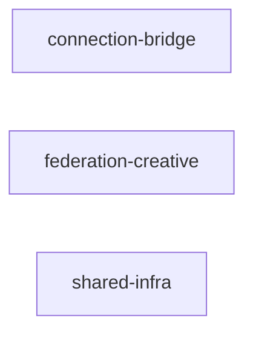
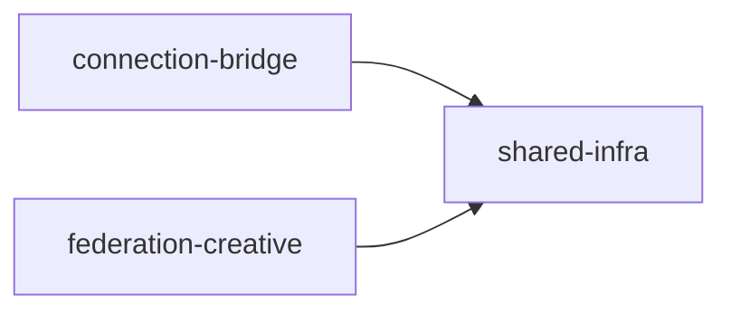

# DEPENDENCY_GRAPH.md

## Inter‑repo dependency edges (Phase 1)

| From repo | To repo | Edge type | Evidence |
|-----------|---------|-----------|----------|
| *(none)* | *(none)* | *(none)* | No cross‑repo import/require statements detected |

The three Phase 1 target repositories are **fully independent** at the code level. No import edges exist between them.

## Phase 1 — Remote status (extracted & verified)

| Repo | GitHub URL | Default branch | HEAD commit | Extraction date | Status |
|------|------------|---------------|-------------|-----------------|--------|
| shared-infra | https://github.com/vortsghost2025/shared-infra | main | 6a122b816b8434855a7eacae65fc47c112b3a534 | 2026-04-27 | REMOTE VERIFIED |
| federation-creative | https://github.com/vortsghost2025/federation-creative | master | d9903446d7a02973eae150a3269f7426e3ef916e | 2026-04-27 | REMOTE VERIFIED |
| connection-bridge | https://github.com/vortsghost2025/connection-bridge | master | 9488905aa3b8166eb4c981e1f6e212af611bea91 | 2026-04-27 | REMOTE VERIFIED |

**Note:** All three repos were created remotely and shallow‑cloned to verify file trees. Original FreeAgent source paths remain preserved. Zero dependency edges exist (and remain preserved) unless a real package dependency is added in the future.

## Mermaid diagram — current state

Three isolated nodes with no edges.

## Mermaid diagram — future state (after shared‑infra is adopted as a dependency)

Once `connection-bridge` and `federation-creative` are configured to install `shared-infra` as a package dependency, the graph becomes:

This is the intended target architecture. The edges are **package‑dependency edges**, not import‑path edges. They will be realized through `package.json` `"dependencies"` entries, not relative `../` imports.

## Circular dependency check

| Pair | Circular? | Notes |
|------|-----------|-------|
| `connection-bridge` ↔ `federation-creative` | No | No imports in either direction |
| `connection-bridge` ↔ `shared-infra` | No | No imports; future dependency is one‑way (app → infra) |
| `federation-creative` ↔ `shared-infra` | No | No imports; future dependency is one‑way (app → infra) |

**No circular dependencies exist.**

## Coupling analysis — components excluded from Phase 1

These components are **CORE‑COUPLED** and remain in `freeagent-core` until API boundary refactoring is completed:

| Component | Coupling type | Target repo (future) |
|-----------|--------------|---------------------|
| `we4free_global/` | Imports `/api/services/` core endpoints | `we4free-mesh` (after API client wrapper) |
| `WE4FREE/` | References core runtime modules | `we4free-mesh` (after API client wrapper) |
| `we4free_website/` | May reference core API | `we4free-web` (needs coupling check) |
| `medical/` | Imports `core/logger`, `core/metrics` | `medical-demos` (after API client wrapper) |
| `medical_data_poc/` | May contain PHI + core imports | `medical-demos` (after review) |
| `src/`, `agents/`, `core/`, `service_orchestration/`, `coordination/`, `AGENT_COORDINATION/` | Core runtime | `freeagent-core` (stays) |

## Full dependency matrix (all seven projects)

| ↓ From / To → | freeagent-core | connection-bridge | federation-creative | shared-infra | we4free-mesh | medical-demos | archive |
|----------------|----------------|-------------------|---------------------|--------------|--------------|---------------|---------|
| **freeagent-core** | — | — | — | uses | — | — | — |
| **connection-bridge** | — | — | — | *(future)* | — | — | — |
| **federation-creative** | — | — | — | *(future)* | — | — | — |
| **shared-infra** | — | — | — | — | — | — | — |
| **we4free-mesh** | **CORE‑COUPLED** | — | — | uses | — | — | — |
| **medical-demos** | **CORE‑COUPLED** | — | — | uses | — | — | — |
| **archive** | — | — | — | — | — | — | — |

## Extraction order (validated)

1. **`shared-infra`** — no inbound dependencies; standalone.
2. **`federation-creative`** — no inbound or outbound dependencies; standalone.
3. **`connection-bridge`** — no inbound or outbound dependencies; standalone.

Any order would work since there are no edges, but `shared-infra` first is preferred because the other two repos may adopt it as a package dependency in the future.
