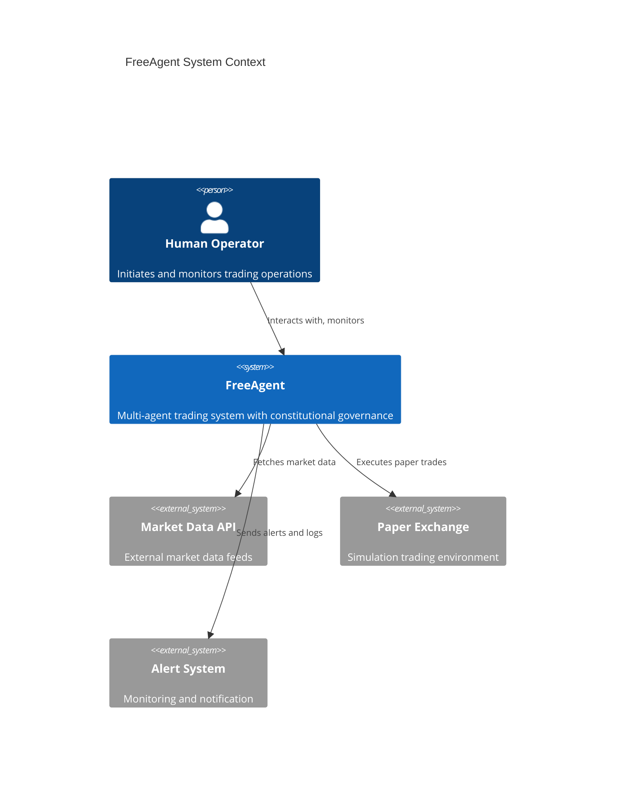
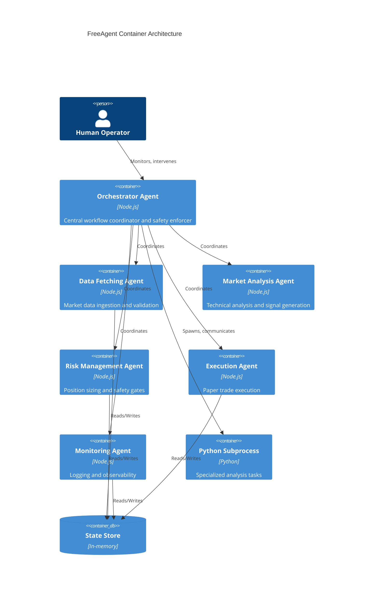

# Project Architecture Blueprint

## 1. Architecture Detection & Analysis

### Technology Stack (Auto-detected)
- **Primary Language**: JavaScript/Node.js with Python subprocess integration
- **Architecture Pattern**: Orchestrated Monolithic Architecture with Distributed Agent Processes
- **Core Framework**: Custom multi-agent trading system with constitutional governance
- **Communication**: Agent-to-agent via orchestrator using JSON-based messaging
- **Runtime Environment**: Node.js with embedded Python agents for specialized tasks

### Architectural Pattern (Auto-detected)
- **Pattern**: Orchestrated Monolithic Architecture with Agent Distribution
- **Constitutional AI Framework**: 7 Laws governance model
- **Key Characteristics**: 
  - Central orchestrator coordinating distributed agent processes
  - Safety invariants enforced at orchestration layer
  - Deterministic workflow with state management
  - Multi-layer validation gates

## 2. Architectural Overview

### 2.1 Overall Architecture
The FreeAgent system follows an **Orchestrated Monolithic Architecture** with distributed agent processes. The system centers around an `OrchestratorAgent` that coordinates all workflow and enforces constitutional safety laws.

### 2.2 Guiding Principles
- **Safety First**: Halt on uncertainty, validate all inputs/outputs
- **Determinism**: Same inputs produce same outputs, no hidden state
- **Transparency**: Every action logged and explainable
- **Modularity**: Agents are replaceable without system breakage
- **Governance**: 7 Constitutional Laws enforced at every step
- **Observability**: Full state tracking and event logging

### 2.3 Architectural Boundaries
- **Orchestrator Layer**: Central coordination, safety enforcement, workflow management
- **Agent Layer**: Distributed specialized agents (DataFetching, MarketAnalysis, RiskManagement, Execution, Monitoring)
- **Observability Layer**: JSON logs, human logs, state tracking
- **Boundary Enforcement**: Agents communicate ONLY through orchestrator, never directly

## 3. Architecture Visualization (C4 Model)

### Level 1: System Context


### Level 2: Container Diagram


## 4. Core Architectural Components

### 4.1 OrchestratorAgent
**Purpose & Responsibility:**
- Central workflow coordinator managing all agent activities
- Enforces 7 Constitutional Laws at every decision point
- Maintains system state and handles transitions
- Implements circuit breakers and safety gates

**Internal Structure:**
- `WorkflowStage` enum: IDLE, FETCHING_DATA, ANALYZING, BACKTESTING, RISK_ASSESSMENT, EXECUTING, MONITORING, ERROR, PAUSED
- Agent registry mapping agent names to instances
- Workflow history and trace logging
- Circuit breaker state management

**Interaction Patterns:**
- Registers and coordinates all specialized agents
- Receives commands from operator
- Sequentially invokes agents in workflow stages
- Enforces safety checks between stages

**Evolution Patterns:**
- New agents can be registered via `register_agent()`
- Workflow stages can be extended via enum
- Circuit breaker thresholds are configurable

### 4.2 DataFetchingAgent
**Purpose & Responsibility:**
- Ingests and validates market data from external APIs
- Ensures data freshness and integrity
- Caches validated results for downstream agents

**Internal Structure:**
- Data validation pipeline
- API rate limiting and error handling
- Local caching mechanism

**Interaction Patterns:**
- Called by orchestrator at workflow start
- Publishes validated data to state store
- Errors trigger orchestrator pause

### 4.3 RiskManagementAgent
**Purpose & Responsibility:**
- Enforces position sizing rules (1% max risk)
- Implements circuit breakers and stop-loss logic
- Validates all trades against safety constraints

**Internal Structure:**
- Position tracking and sizing algorithms
- Circuit breaker state machine
- Daily loss limit monitoring
- Notional value validation

**Interaction Patterns:**
- Called before execution stage
- Veto power over all trades
- Pauses orchestrator on violations

### 4.4 ExecutionAgent
**Purpose & Responsibility:**
- Executes paper trades in simulation environment
- Ensures deterministic execution
- Maintains execution audit trail

**Internal Structure:**
- Paper trade simulation logic
- Order book state management
- Execution logging

**Interaction Patterns:**
- Called only after risk approval
- Publishes execution results to state
- Logs all trade details

## 5. Architectural Layers and Dependencies

### Layer Structure
```
Layer 5: Presentation/Monitoring (Monitor Agent)
    ↓
Layer 4: Execution (Execution Agent)
    ↓
Layer 3: Decision (Market Analysis Agent, Backtesting Agent)
    ↓
Layer 2: Risk Control (Risk Management Agent)
    ↓
Layer 1: Data (Data Fetching Agent)
    ↑
Layer 0: Orchestration (Orchestrator Agent)
```

### Dependency Rules
- **Strict Top-Down Flow**: Layers depend only on layers below them
- **Orchestrator Dependency**: All layers depend on orchestrator for coordination
- **No Cross-Dependencies**: Agents cannot directly reference each other
- **State-Driven**: Data flows through centralized state store

### Dependency Injection Patterns
- Orchestrator holds registry of all agents
- Agents receive config via constructor injection
- State store accessed via orchestrator mediation

## 6. Data Architecture

### Domain Model Structure
```
MarketState:
  - prices: Map<symbol, PriceData>
  - indicators: Map<symbol, TechnicalIndicators>
  - signals: Map<signal_id, SignalData>
  - positions: Map<symbol, Position>

SignalData:
  - type: 'LONG' | 'SHORT' | 'NEUTRAL'
  - confidence: number (0-10)
  - indicators: string[]
  - timestamp: ISO8601

Position:
  - symbol: string
  - size: number
  - entry_price: number
  - stop_loss: number
  - take_profit: number
  - timestamp: ISO8601
```

### Data Access Patterns
- All data access mediated through orchestrator
- State store is single source of truth
- Agents read/write via orchestrator methods
- Immutable data snapshots for analysis

### Caching Strategies
- Market data cached for 1 cycle
- Analysis results cached for workflow duration
- State changes trigger cache invalidation

## 7. Cross-Cutting Concerns Implementation

### 7.1 Authentication & Authorization
- **Security Model**: Role-based access through orchestrator
- **Permission Enforcement**: Orchestrator validates all agent actions
- **Identity Management**: Each agent has unique identity and permissions
- **Security Boundaries**: Agents cannot access unauthorized resources

### 7.2 Error Handling & Resilience
- **Exception Handling**: Structured error propagation through orchestrator
- **Retry Logic**: Configurable retry with exponential backoff
- **Circuit Breaker**: Automatic pause on repeated failures
- **Fallback Strategies**: Graceful degradation on errors

### 7.3 Logging & Monitoring
- **Instrumentation Pattern**: Structured JSON logging throughout
- **Observability Implementation**: State transitions logged with context
- **Diagnostic Flow**: Complete trace of decision pipeline
- **Performance Monitoring**: Timing metrics for all workflow stages

### 7.4 Validation
- **Input Validation**: All external data validated by DataFetchingAgent
- **Business Rule Validation**: RiskManagementAgent enforces rules
- **Validation Responsibility Distribution**: Layered validation approach
- **Error Reporting**: Structured error reporting through orchestrator

### 7.5 Configuration Management
- **Config Source**: Environment variables and config files
- **Environment Strategy**: Separate configs for paper/live modes
- **Secret Management**: Configuration-based secrets (not in code)
- **Feature Flags**: Environment-controlled feature activation

## 8. Service Communication Patterns

### Communication Protocols
- **Primary Protocol**: Method calls through orchestrator
- **Message Format**: JSON with typed envelopes
- **Synchronous vs Asynchronous**: Synchronous within workflow, async for external APIs
- **API Versioning**: Config-based version routing

### Service Discovery
- **Internal Discovery**: Orchestrator registry
- **External Discovery**: Config-based API endpoints
- **Health Checks**: Built into agent lifecycle
- **Circuit Breaker Integration**: Automatic failover

## 9. Technology-Specific Architectural Patterns

### JavaScript/Node.js Patterns
- **Agent Architecture**: Class-based agents with BaseAgent inheritance
- **Event Loop Management**: Async/await throughout
- **Module System**: ES6 modules with agent-specific files
- **State Management**: In-memory state with JSON serialization

### Python Integration Patterns
- **Subprocess Management**: Child process for specialized Python tasks
- **IPC Mechanism**: JSON over stdin/stdout
- **Error Handling**: Structured error codes and messages
- **Resource Management**: Process lifecycle control

## 10. Implementation Patterns

### 10.1 Interface Design Patterns
- **BaseAgent Interface**: Common interface for all agents
- **Abstract Methods**: `initialize()`, `execute()`, `handleError()`
- **Extension Points**: Configurable hooks for custom behavior
- **Default Implementations**: Base class provides safe defaults

### 10.2 Service Implementation Patterns
- **Service Lifetime**: Long-running processes with state persistence
- **Service Composition**: Orchestrator composes agent workflows
- **Operation Templates**: Standardized execution flow
- **Error Handling Within Services**: Localized error recovery

### 10.3 Repository Implementation Patterns
- **In-Memory State**: Simple object-based storage
- **Transaction Management**: Atomic state updates through orchestrator
- **Concurrency Handling**: Single-threaded event loop model
- **Bulk Operations**: Batch state updates

### 10.4 Controller/API Implementation Patterns
- **Command Pattern**: All actions go through orchestrator commands
- **Request Validation**: Input validation before processing
- **Response Formatting**: Structured response objects
- **API Versioning**: Config-based routing

### 10.5 Domain Model Implementation
- **Entity Implementation**: Plain JavaScript objects with validation
- **Value Object Patterns**: Immutable data structures
- **Domain Event Implementation**: Event-driven architecture
- **Business Rule Enforcement**: Layered validation

## 11. Testing Architecture
- **Testing Strategies**: Unit tests for agents, integration tests for workflow
- **Test Boundaries**: Mock orchestrator for agent testing
- **Test Doubles**: Stubs for market data, mocks for external APIs
- **Test Data Strategies**: Synthetic data generation

## 12. Deployment Architecture
- **Deployment Topology**: Single process with child agent processes
- **Environment Adaptation**: Config-driven environment behavior
- **Runtime Dependency Resolution**: Node.js module system
- **Configuration Across Environments**: Environment-specific configs

## 13. Extension and Evolution Patterns

### 13.1 Feature Addition Patterns
- **Agent Registration**: New agents register with orchestrator
- **Workflow Extension**: Add new stages to WorkflowStage enum
- **Dependency Introduction**: Register dependencies through orchestrator
- **Configuration Extension**: Extend config schema for new features

### 13.2 Modification Patterns
- **Safe Component Modification**: Replace agent implementations
- **Backward Compatibility**: Maintain existing interfaces
- **Deprecation Patterns**: Graceful feature removal
- **Migration Approaches**: State migration utilities

### 13.3 Integration Patterns
- **External System Integration**: Config-based API integration
- **Adapter Pattern**: Convert external interfaces to internal protocol
- **Anti-Corruption Layer**: Isolate external system changes
- **Service Facade**: Unified interface to complex subsystems

## 14. Architectural Pattern Examples

### 14.1 Layer Separation Examples
- **Orchestrator-Independent**: Agents can test without orchestrator via mocks
- **Cross-Layer Communication**: Only through defined interfaces
- **Dependency Direction**: Always downward through layers

### 14.2 Component Communication Examples
- **Service Invocation**: Orchestrator calls agent methods
- **Event Publication**: Agents publish to orchestrator events
- **Message Passing**: Structured message envelopes
- **Data Flow**: State-driven data propagation

### 14.3 Extension Point Examples
- **Plugin Registration**: `orchestrator.register_agent()`
- **Workflow Hooks**: Override specific workflow stages
- **Configuration-Driven**: Feature flags control behavior
- **Custom Implementations**: Replace agent logic via subclassing

## 15. Architecture Governance

### 15.1 Consistency Maintenance
- **Pattern Enforcement**: Code reviews check architectural patterns
- **Automated Checks**: Linting for architectural violations
- **Review Processes**: Architecture review for significant changes
- **Documentation Practices**: Architecture decisions documented

### 15.2 Automated Checks
- **Dependency Validation**: Verify layer dependencies
- **Interface Compliance**: Check agent interface implementation
- **Safety Rule Enforcement**: Validate configuration against safety rules
- **Performance Monitoring**: Track performance metrics

### 15.3 Architectural Review
- **Change Impact Analysis**: Assess architectural impact of changes
- **Pattern Alignment**: Verify adherence to architectural patterns
- **Risk Assessment**: Evaluate risk of architectural changes
- **Migration Planning**: Plan for architectural evolution

### 15.4 Documentation Practices
- **Architecture Decision Records**: Document key decisions
- **Pattern Documentation**: Document implemented patterns
- **Example Code**: Provide working examples
- **Reference Materials**: Maintain pattern catalog

## 16. Blueprint for New Development

### 16.1 Development Workflow
1. **Starting Point**: Choose agent type based on responsibility
2. **Component Creation**: Implement agent class following BaseAgent
3. **Integration**: Register with orchestrator
4. **Testing**: Unit test agent independently
5. **Workflow Integration**: Add to orchestrator workflow
6. **Validation**: Run full workflow tests

### 16.2 Implementation Templates

**New Agent Template:**
```javascript
class NewAgent extends BaseAgent {
  constructor(config) {
    super("AgentName", config);
  }
  
  async initialize() {
    // Setup logic
  }
  
  async execute(input) {
    // Core logic
    return result;
  }
  
  handleError(error) {
    // Error recovery
  }
}
```

**Agent Registration:**
```javascript
orchestrator.register_agent(new NewAgent(config));
```

### 16.3 Common Pitfalls
- **Architecture Violations**: Bypassing orchestrator
- **State Management**: Uncontrolled state mutations
- **Error Handling**: Unhandled promise rejections
- **Testing Blind Spots**: Not testing agent isolation

### 16.4 Performance Considerations
- **Memory Usage**: Monitor agent memory consumption
- **Processing Time**: Track workflow execution time
- **Concurrency Limits**: Control parallel execution
- **Resource Management**: Clean up agent resources

### 16.5 Testing Considerations
- **Agent Isolation**: Test agents independently
- **Workflow Integration**: Test full workflows
- **Failure Scenarios**: Test error paths
- **Performance Testing**: Load test critical paths

---

**Blueprint Generated**: $(date -u +"%Y-%m-%dT%H:%M:%SZ")  
**Status**: Production Ready  
**Next Review**: Document updates with architecture changes

This blueprint provides a definitive reference for maintaining architectural consistency in the FreeAgent system, documenting the constitutional AI framework, agent distribution patterns, and governance model that ensures safe, predictable trading operations.
