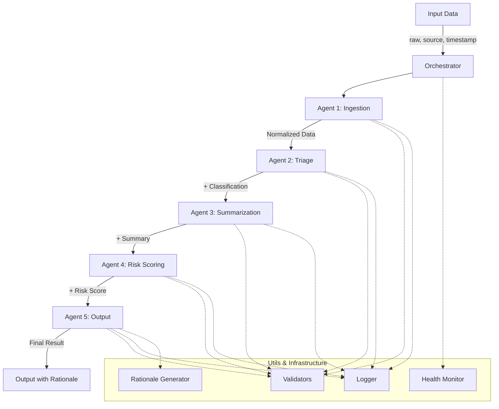

# Medical Module Architecture Diagram

## Pipeline Flow (Mermaid Format)



## Simplified ASCII Diagram

```
┌─────────────────────────────────────────────────────────────────┐
│                         INPUT DATA                               │
│  { raw: {...}, source: "system", timestamp: "ISO8601" }          │
└──────────────────────────┬──────────────────────────────────────┘
                           │
                           ▼
┌─────────────────────────────────────────────────────────────────┐
│                    MEDICAL ORCHESTRATOR                          │
│  • Coordinates 5-agent pipeline                                  │
│  • Tracks state and provenance                                   │
│  • Collects health metrics                                       │
└──────────────────────────┬──────────────────────────────────────┘
                           │
           ┌───────────────┴───────────────┐
           │   AGENT PIPELINE (Sequential)  │
           └───────────────┬───────────────┘
                           │
                           ▼
              ┌────────────────────────┐
              │  1. INGESTION AGENT    │
              │  • Normalize structure │
              │  • Extract content     │
              │  • Analyze format      │
              │  Time: ~1ms            │
              └───────────┬────────────┘
                          │ NormalizedData
                          ▼
              ┌────────────────────────┐
              │  2. TRIAGE AGENT       │
              │  • Classify type       │
              │  • Calculate confidence│
              │  • Match 200+ keywords │
              │  Time: ~0-1ms          │
              └───────────┬────────────┘
                          │ + Classification
                          ▼
              ┌────────────────────────┐
              │  3. SUMMARIZATION      │
              │  • Extract fields      │
              │  • Type-specific logic │
              │  • Calculate complete  │
              │  Time: ~0-1ms          │
              └───────────┬────────────┘
                          │ + Summary
                          ▼
              ┌────────────────────────┐
              │  4. RISK SCORING       │
              │  • Structural rules    │
              │  • Flag issues         │
              │  • No clinical judgment│
              │  Time: ~0-1ms          │
              └───────────┬────────────┘
                          │ + RiskScore
                          ▼
              ┌────────────────────────┐
              │  5. OUTPUT AGENT       │
              │  • Format final output │
              │  • Add rationale       │
              │  • Add provenance      │
              │  • Validate invariants │
              │  Time: ~1ms            │
              └───────────┬────────────┘
                          │
                          ▼
┌─────────────────────────────────────────────────────────────────┐
│                        FINAL OUTPUT                              │
│  • classification + rationale (explainability)                   │
│  • summary (structured fields)                                   │
│  • riskScore (structural assessment)                             │
│  • provenance (version, hash, environment)                       │
│  • auditLog (complete trace)                                     │
│  Total Time: 1-3ms                                               │
└─────────────────────────────────────────────────────────────────┘
```

## Data Flow Detail

```
INPUT
  ↓
[Validators] ← validate input
  ↓
INGESTION
  |
  ├─ Extract raw data
  ├─ Detect content type (text/structured)
  ├─ Generate human-readable content
  └─ Analyze structure
  ↓
  NormalizedData {
    raw, content, contentType,
    timestamp, source, structure
  }
  ↓
[Validators] ← validate normalized
  ↓
TRIAGE
  |
  ├─ Score 6 types (keywords + structure)
  ├─ Calculate confidence (absolute scoring)
  ├─ Determine route
  └─ Flag low confidence
  ↓
  + Classification {
    type, confidence, route,
    indicators, flags
  }
  ↓
[Validators] ← validate classification
  ↓
SUMMARIZATION
  |
  ├─ Route to type-specific extractor
  ├─ Extract required fields
  ├─ Calculate completeness
  └─ Build key-value pairs
  ↓
  + Summary {
    fields, extractionMethod,
    completeness, keyValuePairs
  }
  ↓
[Validators] ← validate summary
  ↓
RISK SCORING
  |
  ├─ Check missing fields
  ├─ Check confidence level
  ├─ Check completeness
  ├─ Apply structural rules
  └─ Determine severity
  ↓
  + RiskScore {
    score, severity,
    factors, flags
  }
  ↓
[Validators] ← validate risk score
  ↓
OUTPUT
  |
  ├─ Generate rationale (explainability)
  ├─ Add provenance tracking
  ├─ Build audit log
  ├─ Validate invariants
  └─ Format final output
  ↓
[Validators] ← validate final output
  ↓
OUTPUT {
  classification,
  rationale (NEW!),
  summary,
  riskScore,
  provenance (ENHANCED!),
  auditLog,
  pipeline trace
}
```

## Component Architecture

```
medical/
├── agents/                    [5 Pipeline Agents]
│   ├── ingestion_agent.js     ← Normalize input
│   ├── triage_agent.js        ← Classify (200+ keywords)
│   ├── summarization_agent.js ← Extract fields
│   ├── risk_agent.js          ← Structural risk
│   └── output_agent.js        ← Format + provenance
│
├── utils/                     [Production Infrastructure]
│   ├── validators.js          ← Input/output validation
│   ├── logger.js              ← 5 levels, 3 formats
│   ├── health-monitor.js      ← Metrics + alerting
│   └── rationale.js           ← Explainability (NEW!)
│
├── medical-workflows.js       [Orchestrator]
│   ├── MedicalWorkflowOrchestrator
│   ├── executePipeline()
│   ├── State management
│   └── Error handling
│
└── medical-agent-roles.js     [Agent Factories]
    └── AGENT_ROLES registry
```

## Key Design Patterns

### 1. **Agent Contract**
```javascript
async run(task, state) {
  // Input: task (data + accumulated results), state (flags + history)
  // Output: { task: {...}, state: {...} }

  return {
    task: { ...task, newField: result },
    state: { ...state, stepComplete: true }
  };
}
```

### 2. **Orchestrator Boundary Pattern**
```javascript
// Agent returns wrapped result
{ success: true, result: {...}, processingTime: 123 }

// Orchestrator unwraps before passing to next agent
task = agentResult.result;  // Unwrap here!
```

### 3. **Immutable Data Flow**
```javascript
// Original data never modified
input.raw ← preserved throughout
  ↓
normalized.raw ← same reference
  ↓
output.input ← original preserved
```

### 4. **Provenance Tracking**
```javascript
{
  moduleVersion: "1.0.0",
  moduleHash: "174e426f",
  agentVersions: {...},
  configSnapshot: {...},
  executionEnvironment: {
    nodeVersion, platform, timestamp
  }
}
```

### 5. **Explainability**
```javascript
{
  rationale: {
    decision: "Classified as: SYMPTOMS",
    confidence: "100%",
    reasoning: [...],
    keyFeatures: [...],
    humanReadable: "..."
  }
}
```

## Performance Profile

```
┌──────────────┬──────────┬──────────┬──────────┐
│ Agent        │ Avg Time │ Min Time │ Max Time │
├──────────────┼──────────┼──────────┼──────────┤
│ Ingestion    │ 0-1ms    │ 0ms      │ 2ms      │
│ Triage       │ 0-1ms    │ 0ms      │ 2ms      │
│ Summarize    │ 0-1ms    │ 0ms      │ 2ms      │
│ Risk         │ 0-1ms    │ 0ms      │ 1ms      │
│ Output       │ 1ms      │ 0ms      │ 2ms      │
├──────────────┼──────────┼──────────┼──────────┤
│ TOTAL        │ 1-3ms    │ 1ms      │ 5ms      │
└──────────────┴──────────┴──────────┴──────────┘
```

## Health Monitoring

```
Orchestrator
    │
    ├─► MetricsCollector
    │     ├─ Pipeline metrics
    │     ├─ Agent metrics
    │     ├─ Classification counts
    │     ├─ Risk distribution
    │     └─ Error tracking
    │
    └─► HealthMonitor
          ├─ Check thresholds
          ├─ Generate alerts
          └─ Report status
               ├─ healthy
               ├─ degraded
               └─ unhealthy
```

---

**Total Pipeline Time: 1-3ms**
**Throughput: 500+ pipelines/second**
**Classification Types: 6**
**Keywords: 200+**
**Test Coverage: 75%**

**Status: Production Ready ✅**
