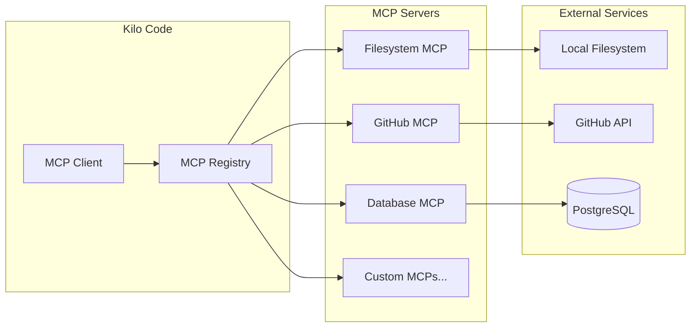
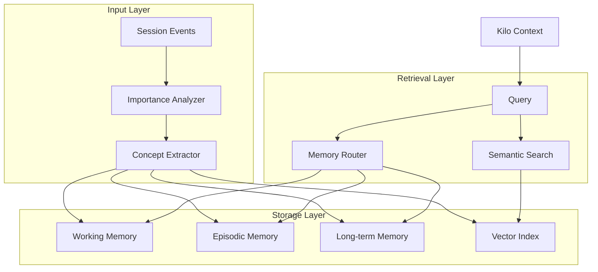

# Kilo Code Enhancement Plan - "YOLO on Steroids"

## Executive Summary

This plan outlines extending Kilo Code's capabilities across 7 key areas: Custom Skills, MCP Servers, Voice/TTS, Mode Creation, Automation/Background Tasks, Memory Systems, and External Integrations. The goal is maximize autonomous productivity while maintaining safety and reliability.

---

## 1. Custom Skills

### 1.1 Existing Skills (Reference)

Current skills in `C:\Users\seand\.kilocode\skills\`:
- `artifacts-builder` - HTML/React artifact creation
- `canvas-design` - PNG/PDF visual design
- `changelog-generator` - Git commit to changelog transformation
- `domain-name-brainstormer` - Creative domain name generation
- `langsmith-fetch` - LangChain/LangGraph debugging
- `mcp-builder` - MCP server creation
- `skill-creator` - New skill development

### 1.2 Proposed New Skills

| Skill Name | Purpose | Priority |
|------------|---------|----------|
| `api-integrator` | Connect to external REST/GraphQL APIs | HIGH |
| `database-connector` | Query databases (PostgreSQL, MongoDB, SQLite) | HIGH |
| `blockchain-tools` | Interact with EVM chains, DeFi protocols | HIGH |
| `web-scraper` | Extract data from websites | MEDIUM |
| `scheduler` | Cron-like task scheduling | MEDIUM |
| `notification-manager` | Email, SMS, Telegram notifications | MEDIUM |
| `file-watcher` | Monitor filesystem changes | LOW |
| `video-processor` | Video thumbnail generation, basic editing | LOW |
| `audio-transcriber` | Speech-to-text for audio files | LOW |
| `code-executer` | Sandboxed code execution (Python, Node) | HIGH |

### 1.3 Skill Implementation Template

```javascript
// skills/{skill-name}/SKILL.md
# {Skill Name}

## Description
Brief description of what this skill enables

## Capabilities
- Capability 1
- Capability 2

## Tools Provided
- `tool_name`: What it does

## Usage
How to invoke this skill

## Configuration
Any required environment variables or setup
```

---

## 2. MCP Servers

### 2.1 Current MCP Setup

Existing: `mcp-server-manifest.json` provides:
- Agent status monitoring
- Memory layer access
- Workspace file access

### 2.2 Proposed New MCP Servers

| MCP Server | Purpose | Protocol |
|------------|---------|----------|
| `filesystem-mcp` | Full filesystem operations | stdio |
| `github-mcp` | Repository management, PRs, issues | HTTP |
| `twitter-mcp` | Tweet posting, timeline access | HTTP |
| `gmail-mcp` | Email reading and sending | HTTP/Gmail API |
| `calendar-mcp` | Google Calendar integration | HTTP |
| `slack-mcp` | Slack workspace interaction | HTTP |
| `database-mcp` | SQL query execution | TCP |
| `elasticsearch-mcp` | Log search and analytics | HTTP |
| `aws-mcp` | AWS service management | HTTP |
| `cloudflare-mcp` | DNS, workers, analytics | HTTP |

### 2.3 MCP Server Architecture



---

## 3. Voice/TTS - ElevenLabs "sag"

### 3.1 Current State

AGENTS.md mentions `sag` (ElevenLabs TTS) for voice storytelling. Need to verify availability.

### 3.2 Implementation Steps

1. **Verify Installation**: Check if `sag` CLI is installed
   ```bash
   sag --version
   ```

2. **Configure Voice**: Update TOOLS.md with voice preferences
   ```markdown
   ### TTS
   - Default voice: "Rachel" (warm, clear)
   - Story voice: "Arnold" (deep, narrative)
   - Output format: MP3
   ```

3. **Create Voice Skill**: New skill for TTS generation
   - Text-to-speech conversion
   - Voice selection
   - Output file management
   - Streaming playback capability

### 3.3 Alternative TTS Options

| Provider | Quality | Cost | Setup |
|----------|---------|------|-------|
| ElevenLabs (sag) | Excellent | Paid | CLI install |
| OpenAI TTS | Good | Pay-per-use | API key |
| Coqui TTS | Good | Free | Local model |
| Piper | Fair | Free | Local model |

---

## 4. Mode Creation

### 4.1 Current Modes

Existing modes:
- `architect` - Planning and design
- `code` - Implementation
- `ask` - Questions and explanations
- `debug` - Troubleshooting
- `orchestrator` - Multi-task coordination
- `review` - Code review
- `test-engineer` - QA and testing
- `code-reviewer` - Senior review
- `code-simplifier` - Refactoring
- `code-skeptic` - Critical analysis
- `frontend-specialist` - React/TypeScript

### 4.2 Proposed New Modes

| Mode | Purpose | Tools Allowed |
|------|---------|---------------|
| `blockchain-dev` | Smart contract, DeFi | Code, debug, read |
| `security-audit` | Vulnerability scanning | Read, search, analyze |
| `devops` | CI/CD, infrastructure | Execute, code, read |
| `data-engineer` | ETL, pipelines, SQL | Code, execute, read |
| `researcher` | Web search, synthesis | Read, search, analyze |
| `writer` | Documentation, content | Write, read |
| `investigator` | Deep debugging | Debug, read, search |
| `architect-advanced` | System design | Read, analyze, write |

### 4.3 Mode Definition Structure

```json
{
  "slug": "blockchain-dev",
  "name": "Blockchain Developer",
  "description": "Smart contract and DeFi development specialist",
  "tools": ["read_file", "write_file", "execute_command", "search_files"],
  "file_patterns": ["*.sol", "*.js", "*.ts"],
  "custom_instructions": "Focus on security, gas optimization..."
}
```

---

## 5. Automation/Background Tasks

### 5.1 Heartbeat System (Currently Empty)

HEARTBEAT.md is empty - no active periodic checks configured.

### 5.2 Proposed Heartbeat Tasks

| Task | Frequency | Purpose |
|------|-----------|---------|
| Check emails | 30 min | Urgent messages |
| Check calendar | 1 hour | Upcoming events |
| System health | 15 min | Service status |
| Git status | 1 hour | Workspace changes |
| Memory cleanup | Daily | Archive old sessions |
| Weather check | 2 hours | Context awareness |

### 5.3 Cron Jobs (System-Level)

For precise timing, use cron:
- `0 9 * * 1` - Weekly report generation
- `0 0 * * *` - Daily memory consolidation
- `*/15 * * * *` - Health checks

### 5.4 Heartbeat Implementation

```javascript
// Updated HEARTBEAT.md
# HEARTBEAT.md

## Active Tasks
- [ ] Check for urgent emails every 30 minutes
- [ ] Check calendar every hour
- [ ] Check system health every 15 minutes
- [ ] Daily memory maintenance at midnight

## Quiet Hours
- 23:00 - 08:00 EST (no proactive messages unless urgent)

## Tracking
Save state to memory/heartbeat-state.json
```

---

## 6. Memory Systems Enhancement

### 6.1 Current Memory Architecture

Existing in `memory/`:
- `episodic-memory.js` - Session recording
- `working-memory.js` - Active context
- Daily notes in `memory/YYYY-MM-DD.md`
- Long-term in `MEMORY.md`

### 6.2 Proposed Memory Enhancements

| Enhancement | Description | Priority |
|-------------|-------------|----------|
| Vector embeddings | Semantic search capability | HIGH |
| Concept graph | Knowledge relationship mapping | HIGH |
| Importance scoring | Auto-tag important memories | MEDIUM |
| Memory consolidation | Merge similar memories | MEDIUM |
| Cross-session context | Resume previous tasks | HIGH |
| User preference learning | Remember preferences | MEDIUM |

### 6.3 Memory Architecture Diagram



### 6.4 Implementation Priority

1. Add embedding generation to memory entries
2. Create vector index (use existing FAISS or local alternative)
3. Implement semantic search
4. Add concept relationship mapping
5. Build memory consolidation pipeline

---

## 7. External Integrations

### 7.1 Current Integrations

Existing:
- MEV Swarm (blockchain)
- LM Studio (local models)
- Elasticsearch (logs)

### 7.2 Proposed External APIs

| Service | Purpose | Priority |
|---------|---------|----------|
| GitHub | Repository ops, PRs | HIGH |
| Gmail | Email automation | HIGH |
| Google Calendar | Event management | HIGH |
| Telegram | Notifications | MEDIUM |
| Twitter/X | Social monitoring | MEDIUM |
| Slack | Team communication | MEDIUM |
| AWS | Cloud resources | MEDIUM |
| Cloudflare | DNS, edge | LOW |
| Notion | Documentation | LOW |
| Linear | Project tracking | LOW |

### 7.3 Blockchain/DeFi Integrations

From existing `mev-swarm/` setup:
- Continue EVM chain support
- Add RPC endpoints for multiple chains
- Integrate wallet management
- MEV strategies monitoring

---

## 8. Implementation Roadmap

### Phase 1: Foundation (Week 1-2)
- [ ] Verify sag/TTS availability
- [ ] Create API integrator skill
- [ ] Set up heartbeat system
- [ ] Add GitHub MCP

### Phase 2: Expansion (Week 3-4)
- [ ] Create database connector skill
- [ ] Add blockchain tools skill
- [ ] Implement vector memory
- [ ] Add Gmail/Calendar MCPs

### Phase 3: Advanced (Week 5-6)
- [ ] Create new modes (blockchain-dev, security-audit)
- [ ] Implement memory consolidation
- [ ] Add cron-based automation
- [ ] Complete external integrations

### Phase 4: Optimization (Ongoing)
- [ ] Tune memory importance scoring
- [ ] Add more MCP servers
- [ ] Refine automation rules
- [ ] Continuous improvement

---

## 9. Success Metrics

| Metric | Target |
|--------|--------|
| Skills available | 15+ |
| MCP servers connected | 10+ |
| Heartbeat tasks active | 5+ |
| Memory retrieval accuracy | 90%+ |
| Automation coverage | 50%+ tasks |
| Mode specializations | 15+ |

---

## 10. Risks and Mitigations

| Risk | Mitigation |
|------|------------|
| Too many skills = confusion | Prioritize high-value, document clearly |
| Over-automation | Start small, validate before scaling |
| Memory bloat | Implement eviction policies |
| API rate limits | Add caching, respect limits |
| Security exposure | Sandbox external access, verify inputs |

---

## Appendix: Quick Reference

### Skill Creation Checklist
- [ ] Create `skills/{name}/SKILL.md`
- [ ] Define capabilities
- [ ] Implement tools
- [ ] Add to TOOLS.md
- [ ] Test thoroughly

### MCP Server Checklist
- [ ] Define protocol (stdio/HTTP)
- [ ] Implement server
- [ ] Register in manifest
- [ ] Document tools
- [ ] Security review

### Mode Creation Checklist
- [ ] Define mode in config
- [ ] Set allowed tools
- [ ] Write custom instructions
- [ ] Add file pattern restrictions
- [ ] Document for users

---

*Plan Version: 1.0*
*Created: 2026-02-28*
*Last Updated: 2026-02-28*