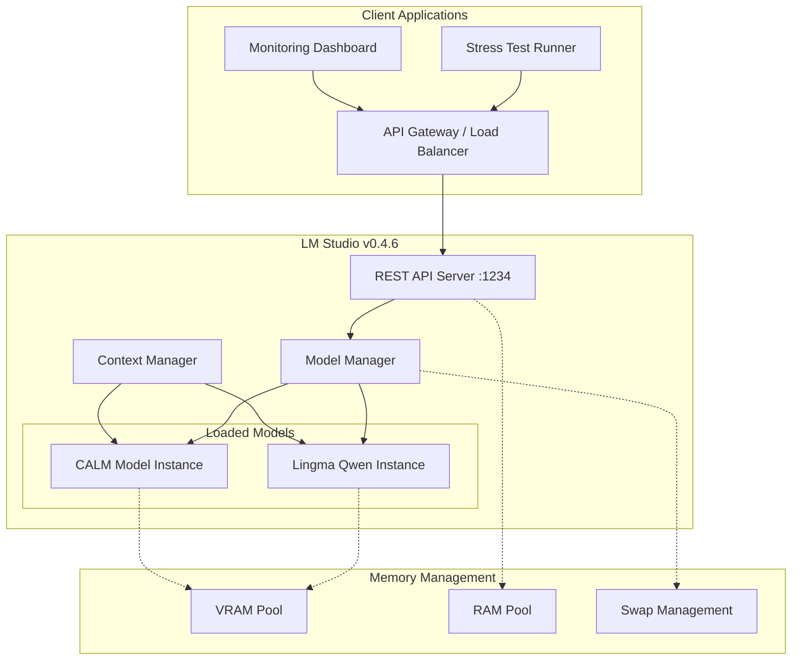
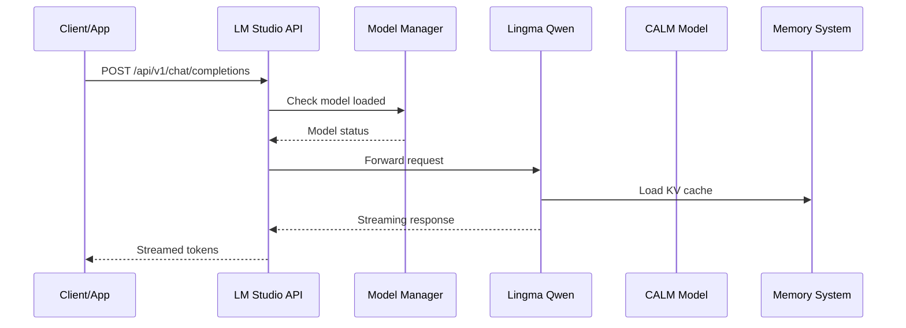
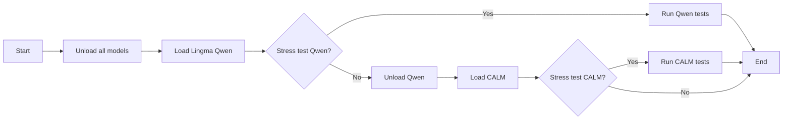
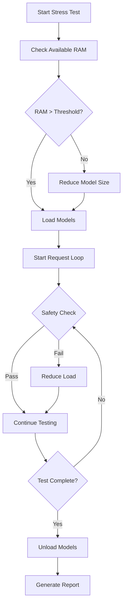

# LM Studio v0.4.6 Multi-Model Architecture Plan

## Executive Summary

This document outlines a comprehensive architecture for running Lingma Qwen and CALM models simultaneously using LM Studio v0.4.6, with a focus on RAM optimization for stress testing scenarios.

**Key Capabilities of LM Studio v0.4.6:**
- REST API with native v1 endpoints `/api/v1/*`
- OpenAI-compatible and Anthropic-compatible endpoints
- Streaming support, stateful chat, model load/unload endpoints
- Custom tools support

---

## 1. System Architecture

### 1.1 High-Level Architecture Diagram



### 1.2 Component Architecture



---

## 2. RAM Optimization Techniques

### 2.1 Memory Consumption Breakdown

| Component | Typical RAM Usage | Optimization Priority |
|-----------|-------------------|----------------------|
| Model Weights (FP16) | ~16GB per 7B params | Critical |
| Model Weights (INT4) | ~4GB per 7B params | Critical |
| KV Cache | 512-4096 tokens @ 2MB | High |
| Context Window | Variable (4K-32K) | High |
| Inference Buffers | ~2-4GB | Medium |
| API Server | ~500MB | Low |

### 2.2 Quantization Strategy

**Recommended Quantization Levels:**

| Model Size | Recommended Quantization | Expected RAM | Use Case |
|------------|-------------------------|--------------|----------|
| 7B Parameters | Q4_K_M or Q5_K_S | 4-6 GB | Production stress tests |
| 14B Parameters | Q4_K_M | 8-10 GB | High-quality inference |
| 32B+ Parameters | Q2_K | 8-12 GB | Memory-constrained |

**Quantization Priority for Lingma Qwen:**
1. Use Q4_K_M for balanced quality/performance
2. Q5_K_S if RAM allows for better quality
3. Avoid Q2_K unless absolutely necessary (significant quality loss)

**Quantization Priority for CALM:**
1. Check CALM's recommended quantization from model card
2. Default to Q4_K_M if no recommendation exists
3. Consider Q3_K_K for simultaneous model loading

### 2.3 Context Length Optimization

**Recommended Context Settings:**

| Scenario | Context Length | Max Tokens | RAM Impact |
|----------|----------------|------------|------------|
| Stress Test (short) | 2048 | 512 | ~2GB per model |
| Standard | 4096 | 1024 | ~4GB per model |
| Extended | 8192 | 2048 | ~6GB per model |
| Long-context | 16384 | 4096 | ~10GB per model |

**Stress Test Configuration:**
- Set `max_tokens` to 256-512 for rapid testing
- Use 2048 context length for initial stress tests
- Scale up only after validating memory stability

### 2.4 RAM Optimization Techniques

**Technique 1: Sequential Model Loading**


**Technique 2: GPU Offloading**
- Enable GPU offloading if CUDA/Metal acceleration available
- Offload full model to GPU when possible
- Use CPU fallback only when GPU memory insufficient

**Technique 3: Memory Pooling**
- Pre-allocate fixed memory buffers
- Reuse KV cache between requests where possible
- Disable context preservation between independent requests

---

## 3. Model Loading/Unloading Strategies

### 3.1 LM Studio API Endpoints

| Endpoint | Method | Purpose |
|----------|--------|---------|
| `/api/v1/models` | GET | List available models |
| `/api/v1/model/load` | POST | Load a model into memory |
| `/api/v1/model/unload` | POST | Unload model from memory |
| `/api/v1/model/status` | GET | Get current model status |
| `/api/v1/chat/completions` | POST | Chat completion |
| `/api/v1/completions` | POST | Text completion |

### 3.2 Model Loading Request Format

```json
POST /api/v1/model/load
{
  "model": "lingma-qwen-7b-q4_k_m",
  "gpu_offload": 1.0,
  "context_length": 4096,
  "threads": 8
}
```

### 3.3 Model Unloading Request Format

```json
POST /api/v1/model/unload
{
  "model": "lingma-qwen-7b-q4_k_m"
}
```

### 3.4 Dynamic Model Management Strategy

**Strategy A: Sequential Loading (Lowest RAM)**
- Load only one model at a time
- Unload before loading the next
- Total RAM: Max(single model RAM)
- Use case: Maximum RAM-constrained environments

**Strategy B: Parallel Loading (Higher RAM, Higher Throughput)**
- Load both models simultaneously
- Requires sufficient RAM for both models
- Total RAM: Sum of both models
- Use case: When both models need to be available

**Strategy C: Hot-Swap Strategy (Balanced)**
- Keep primary model loaded
- Dynamically load/unload secondary model based on request
- Use case: Asymmetric request patterns

### 3.5 Memory Threshold Configuration

```yaml
memory_thresholds:
  warning: 0.75    # Warn at 75% RAM usage
  critical: 0.85  # Critical alert at 85%
  emergency: 0.90  # Trigger unload at 90%
  
model_priority:
  primary: "lingma-qwen"   # First model to keep
  secondary: "calm"        # First model to unload
```

---

## 4. API Configuration

### 4.1 Base Configuration

```yaml
lm_studio:
  host: "localhost"
  port: 1234
  api_version: "v1"
  
endpoints:
  openai_compatible: "/v1/chat/completions"
  anthropic_compatible: "/v1/messages"
  native: "/api/v1/chat/completions"
```

### 4.2 Model Configuration for Each Model

**Lingma Qwen Configuration:**
```json
{
  "model_id": "lingma-qwen-7b",
  "model_path": "models/lingma-qwen-7b-q4_k_m.gguf",
  "context_length": 4096,
  "gpu_offload": 1.0,
  "threads": 8,
  "batch_size": 512,
  "prompt_cache": true
}
```

**CALM Model Configuration:**
```json
{
  "model_id": "calm-7b",
  "model_path": "models/calm-7b-q4_k_m.gguf",
  "context_length": 4096,
  "gpu_offload": 1.0,
  "threads": 8,
  "batch_size": 512,
  "prompt_cache": false
}
```

### 4.3 API Request Examples

**Chat Completion Request:**
```bash
curl -X POST http://localhost:1234/api/v1/chat/completions \
  -H "Content-Type: application/json" \
  -d '{
    "model": "lingma-qwen-7b-q4_k_m",
    "messages": [
      {"role": "user", "content": "Hello, how are you?"}
    ],
    "temperature": 0.7,
    "max_tokens": 256,
    "stream": false
  }'
```

**Streaming Request:**
```bash
curl -X POST http://localhost:1234/api/v1/chat/completions \
  -H "Content-Type: application/json" \
  -d '{
    "model": "lingma-qwen-7b-q4_k_m",
    "messages": [
      {"role": "user", "content": "Tell me a story"}
    ],
    "stream": true
  }'
```

### 4.4 Health Check and Status

```bash
# Get loaded models status
curl http://localhost:1234/api/v1/model/status

# Get available models
curl http://localhost:1234/api/v1/models
```

---

## 5. Stress Test Configuration

### 5.1 Stress Test Types

| Test Type | Description | Memory Pattern |
|-----------|-------------|-----------------|
| Concurrent Requests | Multiple simultaneous API calls | Spike + sustained |
| Sustained Load | Continuous requests over time | Gradual increase |
| Burst Testing | Rapid burst of requests | Short spikes |
| Memory Leak Detection | Long-running test | Slow growth |

### 5.2 Recommended Stress Test Parameters

**Initial Stress Test (Baseline):**
```yaml
concurrent_requests: 5
requests_per_second: 2
duration_minutes: 10
model: "lingma-qwen-7b-q4_k_m"
context_length: 2048
max_tokens: 256
```

**Scaling Stress Test:**
```yaml
concurrent_requests: 10
requests_per_second: 5
duration_minutes: 15
models: ["lingma-qwen-7b-q4_k_m", "calm-7b-q4_k_m"]
context_length: 4096
max_tokens: 512
```

**Maximum Load Test:**
```yaml
concurrent_requests: 20
requests_per_second: 10
duration_minutes: 20
models: ["lingma-qwen-7b-q4_k_m", "calm-7b-q4_k_m"]
context_length: 2048
max_tokens: 256
gpu_offload: 0.5  # Partial offload for stability
```

### 5.3 Memory Safety Limits

```yaml
safety_limits:
  max_concurrent_requests: 20
  max_context_length: 8192
  max_tokens_per_request: 1024
  memory_check_interval_seconds: 5
  
  # Auto-protections
  auto_unload_threshold: 0.85
  auto_scale_down_at: 0.80
  emergency_unload_at: 0.90
```

### 5.4 Stress Test Execution Pattern



---

## 6. Memory Monitoring Approach

### 6.1 Monitoring Metrics

| Metric | Frequency | Alert Threshold |
|--------|-----------|------------------|
| Total RAM Usage | Every 5s | > 75% |
| Per-Process RAM | Every 10s | > 10GB |
| GPU Memory | Every 5s | > 90% |
| Model Memory | Every 10s | N/A |
| Swap Usage | Every 30s | > 0 |
| Request Queue | Every 1s | > 100 |

### 6.2 Monitoring Implementation

**Local Monitoring Script Approach:**
```bash
# Monitor LM Studio RAM usage
watch -n 5 'ps aux | grep lm-studio | grep -v grep'

# Monitor total system memory
watch -n 5 'free -h'

# Monitor GPU memory (if applicable)
nvidia-smi -l 5
```

### 6.3 Automated Memory Protection

**Auto-Unload Trigger:**
```python
# Pseudocode for memory protection
def monitor_memory():
    while True:
        ram_usage = get_ram_usage()
        if ram_usage > 0.90:
            emergency_unload("calm")  # Unload secondary first
            alert("Emergency: RAM at 90%")
        elif ram_usage > 0.85:
            log_warning("RAM approaching critical")
        sleep(5)
```

### 6.4 Log and Diagnostics

```bash
# LM Studio logs location
# Windows: %APPDATA%/lm-studio/logs/
# macOS: ~/Library/Application Support/lm-studio/logs/
# Linux: ~/.config/lm-studio/logs/

# Key log files to monitor
- server.log      # API server logs
- model.log       # Model loading/unloading
- inference.log   # Inference performance
```

---

## 7. Implementation Checklist

- [ ] Install LM Studio v0.4.6
- [ ] Download and organize model files (GGUF format)
- [ ] Configure quantization settings
- [ ] Set up API server configuration
- [ ] Implement model loading/unloading scripts
- [ ] Configure memory monitoring
- [ ] Set up stress test framework
- [ ] Define auto-protection rules
- [ ] Test single model baseline
- [ ] Test dual model configuration
- [ ] Run full stress test suite
- [ ] Document findings and optimize

---

## 8. Decision Matrix: Simultaneous vs Sequential

| Factor | Simultaneous | Sequential |
|--------|-------------|------------|
| RAM Required | 2x model size | 1x model size |
| Latency | Lower (both ready) | Higher (load time) |
| Throughput | Higher | Lower |
| Complexity | Higher | Lower |
| Risk | Higher memory issues | Lower risk |

**Recommendation:**
- For stress tests: Start with sequential, progress to simultaneous
- For production: Use simultaneous with proper safeguards
- For development: Sequential to isolate issues

---

## 9. Appendix: Troubleshooting

### Common Issues and Solutions

| Issue | Cause | Solution |
|-------|-------|----------|
| OOM during load | Insufficient RAM | Use higher quantization |
| Slow inference | CPU bottleneck | Enable GPU offload |
| Context overflow | Context too large | Reduce context length |
| Model conflicts | Same model loaded twice | Use unique model IDs |
| API timeout | Request queue full | Implement request limiting |

---

*Document Version: 1.0*
*Created for: LM Studio v0.4.6*
*Target Models: Lingma Qwen, CALM*
