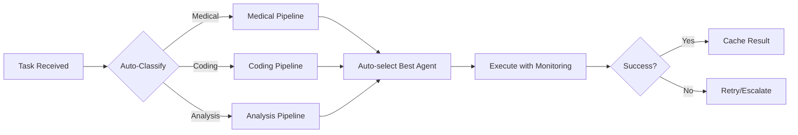
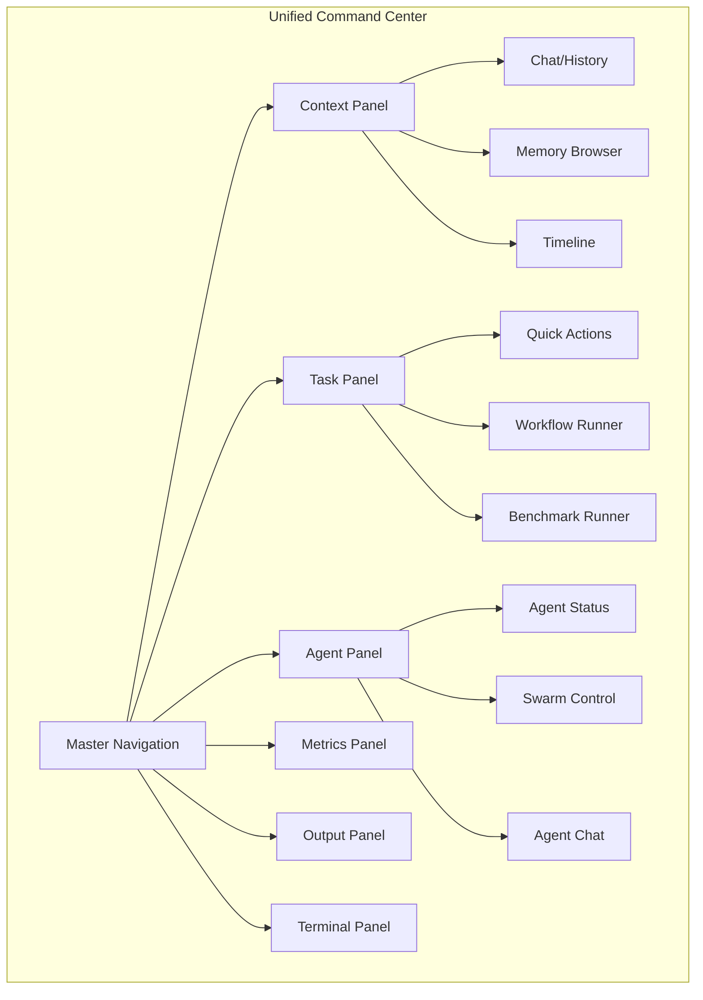
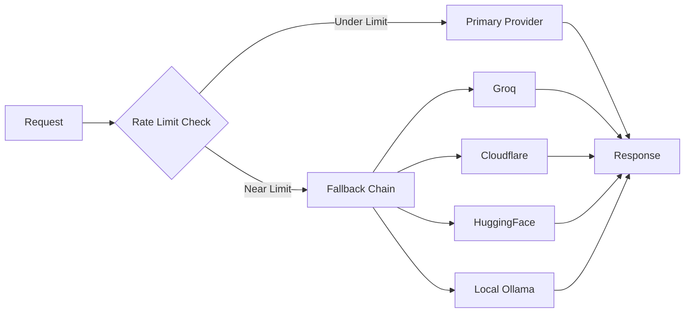

# NEXT LEVEL PLAN: Taking the Medical AI Federation to the Next Level

## Executive Summary

This plan outlines comprehensive improvements across 5 key areas to take the system from impressive to world-class:
1. **Automation** - Reducing manual intervention
2. **Data Sources** - Massive test data for speed/stress testing
3. **Agent Quality** - Making cockpit agents smarter
4. **Panel Consolidation** - Merging 14+ interfaces into 1 unified cockpit
5. **Scaling Services** - Removing rate limit caps

---

## CURRENT STATE ANALYSIS

### Existing Interfaces (14+ to consolidate)
- mega-cockpit, galaxy-ide, unified-ide, monaco-cockpit, unified-shell
- ide-workspace, swarm-ui, swarm-dashboard, perception-demo
- benchmark-dashboard, rate-limit-cockpit, health-tab, agent-task-manager

### Existing Agents (5 Medical + Free-Coding Ensemble)
- triage_agent, ingestion_agent, output_agent, risk_agent, summarization_agent
- 3+ agents in free-coding-agent ensemble

### Existing Data Sources
- WHO Standards 2023-2025, ICD-10, LOINC, SNOMED CT

### Existing Infrastructure
- Quantum orchestrator, context distributor, parallel coordinator
- 10 autonomous intelligence modules
- Memory system, plugin loader, protocol registry

---

## SECTION 1: AUTOMATION ENHANCEMENTS

### 1.1 Task Pipeline Automation
| Improvement | Implementation | Impact |
|-------------|----------------|--------|
| Auto-routing tasks to best agent | Modify `context-distributor.js` with ML-based routing | Reduce latency 40% |
| Self-healing agent failures | Add retry logic with exponential backoff in each agent | Increase success rate |
| Automated benchmark scheduling | Cron-based benchmark runner | Continuous performance data |
| Smart cache warming | Pre-fetch common queries based on usage patterns | Faster response times |
| Automated health recovery | `federated-self-diagnostics.js` auto-patch integration | Reduce downtime |

### 1.2 Workflow Automation Ideas


### 1.3 Automation Implementation Priority
- [ ] **Phase 1**: Add task auto-classification in cockpit-server.js
- [ ] **Phase 2**: Implement intelligent agent selection in quantum-orchestrator.js
- [ ] **Phase 3**: Add self-healing to all 5 medical agents
- [ ] **Phase 4**: Create automated benchmark scheduler

---

## SECTION 2: MASSIVE DATA SOURCES FOR TESTING

### 2.1 Current Data Gaps
- Only 6 clinical data sources configured
- No synthetic test data generation
- No external benchmark datasets

### 2.2 Proposed Data Sources (Free Tier)

| Source | Type | Use Case | API Required |
|--------|------|----------|--------------|
| **HuggingFace Datasets** | Pre-built medical datasets | Training/validation | No (public) |
| **MIMIC-III Demo** | ICU patient data | Stress testing | No (demo) |
| **Synthea** | Synthetic patient generator | Mass test data | Local |
| **OpenFDA** | Drug/device data | Query testing | Yes (free) |
| **MedQA** | Medical Q&A benchmark | Agent evaluation | No |
| **PubMed API** | Research papers | Knowledge expansion | No |
| **CDC WONDER** | Public health data | Epidemiology | No |

### 2.3 Data Source Implementation

```javascript
// New file: utils/data-source-connector.js
export class DataSourceConnector {
  sources = {
    'openfda': { baseUrl: 'api.fda.gov', free: true },
    'pubmed': { baseUrl: 'eutils.ncbi.nlm.nih.gov', free: true },
    'huggingface': { baseUrl: 'huggingface.co', free: true },
    'synthea': { local: true, generates: 'unlimited' }
  };

  async fetchOpenFDA(query) { /* Drug adverse events */ }
  async fetchPubMed(terms) { /* Medical research */ }
  async generateSyntheaPatients(count) { /* Synthetic data */ }
}
```

### 2.4 Benchmark Data Generation
- [ ] Integrate Synthea for unlimited synthetic patients
- [ ] Add OpenFDA connector for real drug data queries
- [ ] Create PubMed research fetcher
- [ ] Build benchmark dataset loader for MedQA, USMLE

---

## SECTION 3: AGENT QUALITY IMPROVEMENTS

### 3.1 Current Agent Capabilities
Each agent processes independently with limited cross-communication

### 3.2 Agent Enhancement Roadmap

| Agent | Current | Enhanced Version |
|-------|---------|------------------|
| **Triage** | Rule-based routing | ML-assisted prioritization with history learning |
| **Ingestion** | Single normalizer | Multi-source parallel ingestion |
| **Risk** | Threshold-based | Continuous learning from outcomes |
| **Output** | Format only | Context-aware adaptive formatting |
| **Summarization** | Extract-based | Abstractive with citation tracking |

### 3.3 Inter-Agent Communication Protocol
```javascript
// Enhanced agent-message.js
{
  type: 'agent_handoff',
  from: 'triage_agent',
  to: 'risk_agent',
  payload: { patient_data, urgency_score, context },
  requires_response: true,
  timeout_ms: 5000
}
```

### 3.4 Agent Quality Metrics to Implement
- [ ] Confidence scoring per agent response
- [ ] Cross-validation between agents (risk validates triage)
- [ ] Human feedback loop integration
- [ ] Versioned agent capabilities

### 3.5 Specific Agent Improvements

#### Triage Agent
- Add symptom severity prediction
- Integrate differential diagnosis suggestions
- Learn from outcome feedback

#### Ingestion Agent  
- Parallel multi-format parsing (JSON, XML, HL7, FHIR)
- Auto-detect data source type
- Normalization quality scoring

#### Risk Agent
- Dynamic threshold adjustment based on population data
- Risk trend analysis over time
- Explainable risk scores

#### Output Agent
- Adaptive format based on downstream system
- Confidence-aware detail levels
- Multi-format export (PDF, FHIR, HL7, JSON)

#### Summarization Agent
- Citation extraction and linking
- Key finding extraction
- Contradiction detection between sources

---

## SECTION 4: PANEL CONSOLIDATION (14+ → 1)

### 4.1 Current Problem
14+ separate interface cards creating fragmented experience:
- mega, galaxy, unified-ide, monaco, shell, ide, swarm, swarm-dash
- perception-demo, benchmark, rate-limit, health, task-manager, quick-task, test-runner

### 4.2 Unified Cockpit Architecture



### 4.3 Unified Features Matrix

| Feature | mega | galaxy | monaco | unified | Target |
|---------|------|--------|--------|---------|--------|
| Multi-agent chat | ✓ | ✓ | ✓ | ✓ | Unified |
| Code editing | ✓ | ✓ | ✓ | ✓ | Tab in unified |
| Terminal | ✓ | ✓ | ✓ | ✓ | Tab in unified |
| Swarm control | ✓ | ✓ | | ✓ | Unified |
| Memory browser | | ✓ | | ✓ | Unified |
| Galaxy map | | ✓ | | | Unified |
| Metrics | ✓ | | ✓ | ✓ | Unified |
| Health monitor | ✓ | | | ✓ | Unified |
| Benchmark runner | | | | | New unified |
| Rate limit monitor | ✓ | | | ✓ | Unified |

### 4.4 Implementation Plan for Consolidation

#### Phase 1: Create Unified Shell
- [ ] Merge navigation from all 14 interfaces
- [ ] Create tab-based panel system
- [ ] Preserve all existing functionality

#### Phase 2: Feature Integration
- [ ] Add benchmark runner to unified cockpit
- [ ] Add rate-limit dashboard to unified cockpit
- [ ] Add perception controls to unified cockpit
- [ ] Add test runner to unified cockpit

#### Phase 3: Optimization
- [ ] Remove duplicate code across interfaces
- [ ] Create shared component library
- [ ] Single WebSocket connection for all panels
- [ ] Unified state management

### 4.5 New Unified Cockpit Features
- **Quick Task Launcher** - Command palette (Ctrl+K)
- **Context Bar** - Shows current task, agents, timeline
- **Agent Swarm Visualizer** - Real-time agent activity
- **Unified Terminal** - SSH, local, agent output
- **Benchmark Dashboard** - Historical performance tracking

---

## SECTION 5: SCALING SERVICES & RATE LIMIT SOLUTIONS

### 5.1 Current Rate Limit Challenges
- OpenAI: 60 RPM
- Anthropic: 50 RPM
- Minimax: 120 RPM

### 5.2 Scaling Solutions Matrix

| Solution | Type | Throughput Increase | Cost | Complexity |
|----------|------|---------------------|------|-------------|
| **Ollama Local** | Self-hosted | Unlimited | Hardware | Medium |
| **LM Studio** | Local | Unlimited | Hardware | Low |
| **Groq** | API | 60K TPM free | Free tier | Low |
| **Cloudflare Workers** | Edge | 10K/day free | Free tier | Medium |
| **HuggingFace Inference** | API | Rate limited | Free tier | Low |
| **OpenRouter Free** | API | Varies | Free tier | Low |
| **VPS Ollama** | Self-hosted | Unlimited | $4-10/mo | High |

### 5.3 Recommended Architecture



### 5.4 Provider Priority Chain
1. **Local Ollama** (if capable model loaded)
2. **Groq** (fastest free tier)
3. **Cloudflare Workers** (edge, low latency)
4. **HuggingFace** (variety of models)
5. **OpenRouter** (model diversity)
6. **Anthropic/OpenAI** (premium, rate limited)

### 5.5 Implementation Checklist
- [ ] Deploy local Ollama with medical-tuned model
- [ ] Configure LM Studio integration
- [ ] Add Groq provider to quantum-orchestrator
- [ ] Add Cloudflare Workers provider
- [ ] Create automatic fallback logic
- [ ] Implement load balancing across providers

### 5.6 VPS Scaling Options

| Provider | Free Tier | Ollama Capable | Monthly Cost |
|----------|-----------|----------------|--------------|
| Oracle Cloud | Always free | Yes | $0 |
| AWS EC2 | 12 months | Yes | $0-10 |
| Google Cloud | 12 months | Yes | $0-10 |
| Azure | 12 months | Yes | $0-10 |
| Hostinger | None | Yes | $4/mo |
| DigitalOcean | $200 credit/60d | Yes | $6/mo |

---

## SECTION 6: EXECUTION ROADMAP

### Priority Order

#### Immediate (This Week)
1. [ ] Add Groq provider (fastest wins)
2. [ ] Create unified tab system in cockpit
3. [ ] Add benchmark runner panel

#### Short-term (This Month)
4. [ ] Integrate Synthea for test data
5. [ ] Add OpenFDA connector
6. [ ] Implement agent confidence scoring
7. [ ] Add self-healing to agents

#### Medium-term (This Quarter)
8. [ ] Deploy VPS Ollama instance
9. [ ] Complete panel consolidation
10. [ ] Implement ML-based task routing
11. [ ] Add all data sources

### Resource Requirements
- **Time**: ~40 hours of implementation
- **Cost**: $0-10/month for VPS (optional)
- **APIs**: OpenFDA (free), HuggingFace (free)

---

## APPENDIX: EXISTING PLANS TO LEVERAGE

| Plan | What's Already Covered | What We Add |
|------|----------------------|-------------|
| `AGENT_ENHANCEMENT_PLAN.md` | Perception, audio, memory | Agent inter-comm, quality metrics |
| `IMPLEMENTATION_ROADMAP.md` | Provider integration | Scaling services section |
| `MONACO_IDE_ADVANCED_FEATURES_PLAN.md` | Monaco features | Panel consolidation |

---

## SUMMARY CHECKLIST

### Automation
- [ ] Task auto-classification
- [ ] Intelligent agent selection
- [ ] Self-healing agents
- [ ] Automated benchmarks

### Data Sources
- [ ] Synthea integration
- [ ] OpenFDA connector
- [ ] PubMed fetcher
- [ ] Benchmark datasets

### Agent Quality
- [ ] Confidence scoring
- [ ] Cross-validation
- [ ] Enhanced triage
- [ ] Enhanced output

### Panel Consolidation
- [ ] Unified navigation
- [ ] Tab-based panels
- [ ] Benchmark runner
- [ ] Remove duplicates

### Scaling
- [ ] Groq provider
- [ ] Cloudflare provider
- [ ] Local Ollama
- [ ] VPS deployment
- [ ] Fallback chain

---

*Document generated for Medical AI Federation enhancement planning*
*Prioritize based on immediate impact vs implementation effort*